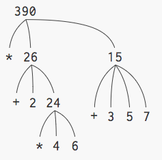
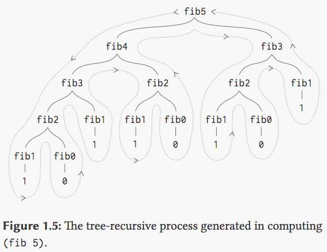

# Notes

## Preface

Goals of the book:

- Establish the idea that a computer language is not just a way of getting a computer to perform operations but rather is a novel medium for expressing ideas about methodology. Programs must be written for people to read, and only incidentally for machines to execute.

- The focus of SICP is **not** on:
  - syntax of a particular programming language constructs
  - clever algorithms for computing particular functions efficiently
  - mathematical analysis of algorithms
  - foundations of computing


- The focus is on techniques used to control the intellectual complexity of large software systems.

- Students who complete this subject should have a good feel for the elements of style and the aesthetics of programming. Should have command of the major techniques for controlling complexity in a large system. Should be capable of reading a 50-page long program, if it is written in an exemplary style. Should know what not to read and what they need not understand at any moment.

- These skills are not unique to computer programming. The techniques taught are common to all of engineering design. Controlling complexity by building abstractions that hide details when appropriate.

- Computer Science is not a science and that its significance has to little to do with computers.The computer revolution is a revolution in the way we think and in the way we express what we think.

## Part 1: Building Abstractions with Procedures

#### Processes, Data & Program

  - *Computational processes* are abstract beings that inhabit computers.

  - As they evolve, processes manipulate other abstract things called *data*.

  - The evolution of a process is directed by a pattern of rules called a *program*.

  - People create programs to direct processes.

  - When the author uses the word process. Two ideas come to mind. The first is the physical electrical computational process that occurs inside the computer. And the second is the abstract & typical sense of the word used to describe series of actions taken to achieve a particular end.

  - Interesting that the author refers to data as abstract data. Reminds us that high level languages allow us to think of data in an abstract/normal sense, ignoring implementation details in bits & bytes

#### A Little About Lisp

  - We need an appropriate language for describing processes.

  - Just as our everyday thoughts are expressed in our natural language English, and descriptions of quantitative phenomena are expressed with mathematical notations, our procedural thoughts are expressed in Lisp.

  - Lisp was invented in 1950s. Refer to book for what it was invented for.

  - List is an acronym for LISt Processing.

  - Designed to provide symbol-manipulating capabilities for attacking programming problems such as the symbolic differentiation and integration of algebraic expressions.

  - List is not the product of concerted design effort. It evolved informally in an experimental manner in response to users’ needs and to pragmatic implementation consideration. This evolution, together with the flexibility and elegance of the initial conception, has enabled Lisp, to continually adapt to encompass the most modern ideas about program design.

  - Lisp is now a family of dialects, sharing most original features, but may differ from one another in significant ways.

  - Lisp language was chosen for this book despite it not being a mainstream language as it possess unique features that make it an excellent medium for studying:

    - Important Programming Constructs and Data Structures

    - Linguistic Features that the language supports

      - Most interesting feature of Lisp is that its descriptions of processes, called procedures, can themselves be represented and manipulated as Lisp data. This is important as there are powerful program-design techniques that rely on this ability. The language is useful for helping us to explore these techniques. The ability to represent procedures as data also makes Lisp an excellent language for writing programs that must manipulate other programs as data, such as interpreters and compilers.

### 1.1. Elements of Programming

- A powerful programming language is more than just a means for instructing a computer to perform tasks.

- The language serves as a framework for us to organise our ideas about processes.

- When we describe a language, we should pay attention to the means that the language provides for combining simple ideas to form more complex ideas. Every powerful language has 3 mechanisms for accomplishing this:

  -  **Primitive Expressions**, which represent the simplest entities the language is concerned with

  - **Means of Combination**, by which compound elements are built from simpler ones

  - **Means of Abstraction**, by which compound elements can be named and manipulated as units.

- In programming, we deal with two kinds of elements: **procedures** and **data**. We will soon discover that they are really not so distinct.

- Informally, **data** is “stuff” that we want to manipulate, and **procedures** are descriptions of the rules for manipulating the data. Thus, any powerful programming language should be able to describe primitive data and primitive procedures and should have methods for combining and abstracting procedures and data.

#### Expressions

- The interaction between you and Scheme is called the "read-eval-print loop." Scheme reads what you type, evaluates it, and prints the answer, and then does the same thing over again.

- Each question you type is called an *expression*.

- An expression can be an primitive/atomic expression ```6```.

- Or a compound expression such as ```(+ 14 7)```. Primitive expressions such as ```14, 7``` may be combined with a primitive procedure to form a compound expression.

- A compound expression is made out of smaller expressions. We sometimes call the expressions within a compound expression its subexpressions.

- The metaphor is from chemistry, where atoms of single elements are combined to form chemical compounds.

- In other programming languages, the name for what you type might be a "command" or an "instruction." The name "expression" is meant to emphasise that we are talking about the notation in which you ask the question, as distinct from the idea in your head, just as in English you express an idea in words. Also, in Scheme we are more often asking questions rather than telling the computer to take some action.

- Convention of placing the operator to the left of the operands is known as prefix notation. There are some advantages with prefix notation.

  - It can accommodate procedures that may take an arbitrary number of arguments.

```clojure
(+ 21 35 12 7)
75

(* 25 4 12)
1200
```

  - No ambiguity can arise because the operator is always the leftmost element and the entire combination is delimited by parenthesis.

```clojure
# Ambiguity arises if you are not familiar with mathematical notation rules
1 + 1 * 5 // is this 10 or 6

# No ambiguity here because subexpressions must be evaluated first.
(* (+ 1 1) 5)
```

  - It extends in a straightforward way to allow combinations to be nested, that is, to have combinations whose elements are themselves combinations

```clojure
(+ (* 3 5) (- 10 6))

(+ (* 3
    (+ (* 2 4)
       (+ 3 5)))
 (+ (- 10 7)
    6))
```

#### Naming & Environment

- A critical aspect of a programming language is the means it provides for using names to refer to computational objects. We say that the name identifies a variable whose value is the object.

- Brian Harvey describes a variable in Simply Scheme as a connection between a name and a value.

- Since a variable is the connection between a name and a value, a formal parameter in a procedure definition isn’t a variable; it’s just a name. But when we invoke the procedure with a particular argument, that name is associated with a value, and a variable is created. If we invoke the procedure again, a variable is created, perhaps with a different value.

- In Scheme, we name things with ```define```

- Typing ```(define size 2)``` causes the interpreter to associate the value 2 with the name size. Once the name size has been associated with the number 2, we can refer to the value 2 by name:

```clojure
> size
2

# More Examples

(define pi 3.14159)
(define radius 10)

(* pi (* radius radius))
314.159

(define circumference (* 2 pi radius))

circumference
62.8318
```

- ```Define``` *is lisp’s simplest means of abstraction*, for it allows us to use simple names to refer to the results of compound operations, such as the circumference computed above.

- It should be clear that the possibility of associating values with symbols and later retrieving them means that the interpreter must maintain some sort of memory that keeps track of the name-object pairs. This memory is called the environment (more precisely the global environment, since we will see later that a computation may involve a number of different environments).

**Evaluating Combinations (Compound Expressions)**

- To evaluate a combination, do the following:

  1. Evaluate the subexpressions of the combination.

  2. Apply the procedure that is the value of the leftmost subexpression (the operator) to the arguments that are the values of the other subexpressions (the operands).

- This simple evaluation rule illustrates some important points about processes in general. First, observe that the first step dictates that in order to accomplish the evaluation process for a combination we must first perform the evaluation process on each element of the combination. Thus, the evaluation rule is recursive in nature; that is, it includes, as one of its steps, the need to invoke the rule itself.

- Recursion occurs when a thing is defined in terms of itself.

- It may seem strange that the evaluation rule says, as part of the first step, that we should evaluate the leftmost element of a combination, since at this point that can only be an operator such as + or * representing a built-in primitive procedure such as addition or multiplication. We will see later that it is useful to be able to work with combinations whose operators are themselves compound expressions.

- Evaluating:

```clojure
(* (+ 2 (* 4 6)) (+ 3 5 7))
```

- requires that the evaluation rule be applied to four different combinations. We can obtain a picture of this process by representing the combination in the form of a tree.

<!--  -->
<p align="center">

<p>

- Each combination is represented by a node with branches corresponding to the operator and the operands of the combination stemming from it. The terminal nodes (that is, nodes with no branches stemming from them) represent either operators or numbers.

- Viewing evaluation in terms of the tree, we can imagine that the values of the operands percolate upward, starting from the terminal nodes and then combining at higher and higher levels.

- This “percolate values upward” form of the evaluation rule is an example of a general kind of process known as tree accumulation.

- Next, observe that the repeated application of the first step brings us to the point where we need to evaluate, not combinations, but primitive expressions such as numerals, built-in operators, or other names.

- We take care of the primitive cases by stipulating that:

  - the values of numerals are the numbers that they name,

  - the values of built-in operators are the machine instruction sequences that carry out the corresponding operations,

  - and the values of other names are the objects associated with those names in the environment.

#### Exceptions to the General Form of Evaluation (Special Forms that make up a Language Syntax)

- Notice that the evaluation rule given above does not handle definitions. For instance, evaluating ```(define x 3)``` does not apply define to two arguments, one of which is the value of the symbol x and the other of which is 3, since the purpose of the define is precisely to associate x with a value.

- Such exceptions to the general evaluation rule are called **special forms**.

- Define is the only example of a special form that we have seen so far, but we will meet others shortly. Each special form has its own evaluation rule.

- The various kinds of expressions (each with its associated evaluation rule) constitute the syntax of the programming language.

- In comparison with most other programming languages, Lisp has a very simple syntax; that is, the evaluation rule for expressions can be described by a simple general rule together with specialised rules for a small number of special forms.

#### Compound Procedures

- *Procedure definition* is a much more powerful abstraction technique by which a compound operation can be given a name and then referred to as a unit.

- Let us examining how to express the idea of “squaring.” We might say, “To square something, multiply it by itself.” This is expressed in our language as

```clojure
(define (square x) (* x x))
```

- We can understand this in the following way:

```clojure
(define (square x)    (*       x       x))
   |      |     |      |       |       |
  To square something, multiply it by itself
```

- We have here a compound procedure, which has been given the name square. The procedure represents the operation of multiplying something by itself. Evaluating the definition creates this compound procedure and associates it with the name square.

- Observe that there are two different operations being combined here: we are creating the procedure, and we are giving it the name square. It is possible, indeed important, to be able to separate these two notions—to create procedures without naming them, and to give names to procedures that have already been created. This is shown in 1.3.2.

- The general form of a procedure definition is

```closure
(define (⟨name⟩ ⟨formal parameters⟩) ⟨body⟩)
```

- The ```⟨name⟩``` is a symbol to be associated with the procedure definition in the environment. The ```⟨formal parameters⟩``` are the names used within the body of the procedure to refer to the corresponding arguments of the procedure (upon invocation). The ```⟨body⟩``` is an **expression** that will yield the value of the procedure application when the formal parameters are replaced by the actual arguments to which the procedure is applied. The ```⟨name⟩``` and the ```⟨formal parameters⟩``` are grouped within parentheses, just as they would be in an actual call to the procedure being defined.

- Difference between a Compound Procedure & a Compound Expression? Refer to above.

- Having defined square, we can now use it:

```clojure
(square 21)
441

(square (+ 2 5))
49

(square (square 3))
81
```

- We can also use square as a building block in defining other procedures. For example, ```x2+y2``` can be expressed as

```clojure
(+ (square x) (square y))
```

- We can easily define a procedure sum-of-squares that, given any two numbers as arguments, produces the sum of their squares:

```clojure
(define (sum-of-squares x y)
  (+ (square x) (square y)))

(sum-of-squares 3 4)
25
```

- Now we can use sum-of-squares as a building block in constructing further procedures:

```clojure
(define (f a)
  (sum-of-squares (+ a 1) (* a 2)))

(f 5)
136
```

- Compound procedures are used in exactly the same way as primitive procedures. You can't tell by looking at the definition of sum-of-squares given above whether square was built into the interpreter, like + and *, or defined as a compound procedure.

#### Substitution Model for Procedure Application

- To evaluate a combination whose operator names a compound procedure, the interpreter follows much the same process as for combinations whose operators name primitive procedure.

- To apply a compound procedure to arguments, evaluate the body of the procedure with each formal parameter replaced by the corresponding argument.

- To illustrate this process, let’s evaluate the combination f defined earlier

```clojure
(f 5)
```

- We begin by retrieving the body of f:

```clojure
(sum-of-squares (+ a 1) (* a 2))
```

- Then we replace the formal parameter a by the argument 5:

```clojure
(sum-of-squares (+ 5 1) (* 5 2))
```

- Thus the problem reduces to the evaluation of a combination with two operands and an operator sum-of-squares. Evaluating this combination involves three subproblems. We must evaluate the operator to get the procedure to be applied, and we must evaluate the operands to get the arguments. Now (+ 5 1) produces 6 and (* 5 2) produces 10, so we must apply the sum-of-squares procedure to 6 and 10. These values are substituted for the formal parameters x and y in the body of sum-of-squares, reducing the expression to

```clojure
(+ (square 6) (square 10))
```

- If we use the definition of square, this reduces to

```clojure
(+ (* 6 6) (* 10 10))
```

- which reduces by multiplication to

```clojure
(+ 36 100)
```

- and finally to ```136```

- The process we have just described is called the substitution model for procedure application.

- The purpose of the substitution model is to *help us think about procedure application*, *not to provide a description of how the interpreter really works*. Typical interpreters do not evaluate procedure applications by manipulating the text of a procedure to substitute values for the formal parameters.

- Over the course of this book, we will present a sequence of increasingly elaborate models of how interpreters work, culminating with a complete implementation of an interpreter and compiler in Chapter 5. The substitution model is only the first of these models—a way to get started thinking formally about the evaluation process. **In general, when modeling phenomena in science and engineering, we begin with simplified, incomplete models. As we examine things in greater detail, these simple models become inadequate and must be replaced by more refined models.** The substitution model is no exception. In particular, when we address in Chapter 3 the use of procedures with “mutable data,” we will see that the substitution model breaks down and must be replaced by a more complicated model of procedure application.

#### Applicative Order vs Normal Order

- According to the description of evaluation given above, the interpreter first evaluates the operator and operands and then applies the resulting procedure to the resulting arguments.

- This is not the only way to perform evaluation.

- An alternative evaluation model would not evaluate the operands until their values were needed. Instead it would first substitute operand expressions for parameters until it obtained an expression involving only primitive operators, and would then perform the evaluation.

- If we used this method, the evaluation of (f 5) would proceed according to the sequence of expansions

```clojure
(sum-of-squares (+ 5 1) (* 5 2))

(+ (square (+ 5 1))
   (square (* 5 2)))

(+ (* (+ 5 1) (+ 5 1))
   (* (* 5 2) (* 5 2)))
```

- followed by the reductions

```clojure
(+ (* 6 6)
   (* 10 10))

(+ 36 100)

136
```

- This gives the same answer as our previous evaluation model, but the process is different. In particular, the evaluations of (+ 5 1) and (* 5 2) are each performed twice here.

- This alternative “fully expand and then reduce” evaluation method is known as **normal-order evaluation**, in contrast to the “evaluate the arguments and then apply” method that the interpreter actually uses, which is called **applicative-order evaluation**.

- Lisp uses applicative-order evaluation, partly because of the additional efficiency obtained from avoiding multiple evaluations of expressions such as those illustrated with ```(+ 5 1)``` and ```(* 5 2)``` above and, more significantly, because normal-order evaluation becomes much more complicated to deal with when we leave the realm of procedures that can be modeled by substitution. On the other hand, normal-order evaluation can be an extremely valuable tool, and we will investigate some of its implications in Chapter 3 and Chapter 4

#### Conditional Expressions and Predicates

- Conditionals

- There is a special form in Lisp for notating such a case analysis. It is called ```cond``` (which stands for “conditional”), and it is used as follows:

- The general form of a conditional expression is

```clojure
(cond (⟨p₁⟩ ⟨e₁⟩)
      (⟨p₂⟩ ⟨e₂⟩)
      …
      (⟨pn⟩ ⟨en⟩))
```

- It consists of the symbol cond followed by parenthesized pairs of expressions called clauses.

```clojure
# The entire expression surrounded by the outer parenthesis is the clauses. Not the inner expression denoted with e
(⟨p⟩ ⟨e⟩)
```

 - The first expression in each pair is a *predicate, an expression whose value is interpreted as either true or false*. The word predicate is used for procedures that return true or false

- If

 - The special form ```if```, a restricted type of conditional that can be used when there are precisely two cases in the case analysis.

 - The general form of an if expression is:

```clojure
(if ⟨predicate⟩ ⟨consequent⟩ ⟨alternative⟩)
```

- To evaluate an if expression, the interpreter starts by evaluating the ⟨predicate⟩ part of the expression. If the ⟨predicate⟩ evaluates to a true value, the interpreter then evaluates the ⟨consequent⟩ and returns its value. Otherwise it evaluates the ⟨alternative⟩ and returns its value.

- Logical operators

- In addition to primitive predicates such as <, =, and >, there are logical composition operations, which enable us to construct compound predicates.

```clojure
(and ⟨e₁⟩ … ⟨en⟩)

(or ⟨e₁⟩ … ⟨en⟩)

(not ⟨e⟩)
```

- Notice that and and or are special forms, not procedures, because the subexpressions are not necessarily all evaluated. Not is an ordinary procedure.

- As an example of how these are used, the condition that a number x be in the range 5<x<10 may be expressed as

```clojure
(and (> x 5) (< x 10))
```

#### Example: Square Roots by Newton's Method

- Procedures, as introduced above, are much like ordinary mathematical functions. They specify a value that is determined by one or more parameters. But there is an important difference between mathematical functions and computer procedures. Procedures must be effective.

- A legitimate Square Root mathematical function tells us almost nothing about how to actually find the square root of a given number.

- The contrast between a mathematical function and procedure is a reflection of the general distinction between describing properties of things and describing how to do things, or, as it is sometimes referred to, the distinction between declarative knowledge and imperative knowledge. In mathematics we are usually concerned with declarative (what is) descriptions, whereas in computer science we are usually concerned with imperative (how to) descriptions.

- In a related vein, an important current area in programming-language design is the exploration of so-called very high-level languages, in which one actually programs in terms of declarative statements. The idea is to make interpreters sophisticated enough so that, given “what is” knowledge specified by the programmer, they can generate “how to” knowledge automatically. This cannot be done in general, but there are important areas where progress has been made. We shall revisit this idea in Chapter 4.

- How does one compute square roots? The most common way is to use Newton’s method of successive approximations, which says that whenever we have a guess y for the value of the square root of a number x, we can perform a simple manipulation to get a better guess

- The sqrt program also illustrates that the simple procedural language we have introduced so far is sufficient for writing any purely numerical program that one could write in, say, C or Pascal. This might seem surprising, since we have not included in our language any iterative (looping) constructs that direct the computer to do something over and over again. Sqrt-iter, on the other hand, demonstrates how iteration can be accomplished using no special construct other than the ordinary ability to call a procedure

#### Procedures as Black-Box Abstractions

- We can regard the square procedure as a “black box.” We are not at that moment concerned with how the procedure computes its result, only with the fact that it computes the square. The details of how the square is computed can be suppressed, to be considered at a later time. Indeed, as far as the good-enough? procedure is concerned, square is not quite a procedure but rather an **abstraction of a procedure**, a so-called procedural abstraction. At this level of abstraction, any procedure that computes the square is equally good.

- **Local Names**

- One detail of a procedure’s implementation that should not matter to the user of the procedure is the implementer’s choice of names for the procedure’s formal parameters. Thus, the following procedures should not be distinguishable:

```clojure
(define (square x) (* x x))
(define (square y) (* y y))
```

- This principle—that the meaning of a procedure should be independent of the parameter names used by its author—seems on the surface to be self-evident, but its consequences are profound.

- The simplest consequence is that the parameter names of a procedure must be local to the body of the procedure.

- A formal parameter of a procedure has a very special role in the procedure definition, in that it doesn’t matter what name the formal parameter has. Such a name is called a bound variable, and we say that the procedure definition binds its formal parameters.

- If a variable is not bound, we say that it is free.

#### Internal definitions and block structure

- We have one kind of name isolation available to us so far: The formal parameters of a procedure are local to the body of the procedure. The square-root program illustrates another way in which we would like to control the use of names. The existing program consists of separate procedures:

```clojure
(define (sqrt x)
  (sqrt-iter 1.0 x))

(define (sqrt-iter guess x)
  (if (good-enough? guess x)
      guess
      (sqrt-iter (improve guess x) x)))

(define (good-enough? guess x)
  (< (abs (- (square guess) x)) 0.001))

(define (improve guess x)
  (average guess (/ x guess)))
  ```

- The problem with this program is that the only procedure that is important to users of sqrt is sqrt. The other procedures (sqrt-iter, good-enough?, and improve) only clutter up their minds. They may not define any other procedure called good-enough? as part of another program.

- The problem is especially severe in the construction of large systems by many separate programmers. For example, in the construction of a large library of numerical procedures, many numerical functions are computed as successive approximations and thus might have procedures named good-enough? and improve as auxiliary procedures.

- We would like to localize the subprocedures, hiding them inside sqrt so that sqrt could coexist with other successive approximations, each having its own private good-enough? procedure.

- To make this possible, we allow a procedure to have internal definitions that are local to that procedure.

### 1.2 Procedures and the Processes They Generate

- Having gone through 1.1, we have learned the rules for how the pieces move in chess but know nothing of typical openings, tactics or strategy. We lack the knowledge of which moves are worth making (which procedures are worth defining). We lack the experience to predict the consequences of making a move (executing a procedure).

- A procedure is a pattern for the local evolution of a computational process. It specifies how each stage of the process is built upon the previous stage. *(Definitely would like to explore this definition of a procedure a little bit more)*

- In this section, we will examine common 'shapes' for processes generated by simple procedures. We will also investigate the rates at which these processes consume the important computational resources of time and space.

 #### Linear Recursion & Interation

 - Let's consider the factorial function, defined by

- n! = n . (n - 1) . (n - 2) ... 3 . 2 . 1

- One way to compute n! is:

```clojure
(define (factorial n)
  (if (= n 1)
    1
    (* n (factorial (- n 1)))))
```

- The results in a **linear recursive process** that looks like below. Notice the caller (factorial 6) will not be able to evaluate until the callee (factorial 5) evaluates and this process repeats itself until factorial 1. Thus the state from factorial 6 needs to be remembered while factorial 5 is still executing. 

```clojure
(factorial 6)
(* 6 (factorial 5))
(* 6 (* 5 (factorial 4)))
(* 6 (* 5 (* 4 (factorial 3))))
(* 6 (* 5 (* 4 (* 3 (factorial 2)))))
(* 6 (* 5 (* 4 (* 3 (* 2 (factorial 1))))))
(* 6 (* 5 (* 4 (* 3 (* 2 1)))))
(* 6 (* 5 (* 4 (* 3 2))))
(* 6 (* 5 (* 4 6)))
(* 6 (* 5 24))
(* 6 120)
720
```

- A different way to compute n!:

```clojure
(define (factorial n) 
  (fact-iter 1 1 n))

(define (fact-iter product counter max-count)
  (if (> counter max-count)
      product
      (fact-iter (* counter product)
                 (+ counter 1)
                 max-count)))
```

- The result is a **linear iterative process** that looks like below.

```clojure
(factorial 6)
(fact-iter 1 1 6)
(fact-iter 1 2 6)
(fact-iter 2 3 6)
(fact-iter 6 4 6)
(fact-ter 24 5 6)
(fact-iter 120 6 6)
(fact-iter 720 7 6)
720
```

- Comparing the two processes, they seem hardly different at all. Both compute the same mathematical function on the same domain, and each requires a number of steps proportional to n to compue n!.

- When we consider the 'shapes' of the two processes, we find that they evolve quite differently.

   - The first process reveals a shape of expansion followed by contraction. The expansion occurs as the process builds up a chain of deferred operations (in this case, a chain of multiplications). The contraction occurs as the operations are actually performed. **This type of process , characterised by a chain of deferred operations, is called a recursive process**. Carrying out the process requires that the interpreter keep track of the operations to be performed later on. In the computation of n!, the length of the chain of deferred multiplications, and hence **the amount of information needed to keep track of it, grows linearly with n (is proportional to n), just like the number of steps. Such a process is called a linear recursive process.**

   -  In contrast, the second process does not grow and shrink. At each step, all we need to keep track of, for any n, are the current values of variables ```product, counter, and max-count```. We call this an iterative process. In general, an iterative process is one whose state can be summarized by a fixed number of state variables, together with a fixed rule that describes how the state variables should be updated as the process moves from state to state and an end test that specifies conditions under which the proces should terminate. **In computing n!, the number of steps grows linearly with n. Such a process is called a linear iterative process.**

  - When we discuss the implementation of procedures on register machines in Chapter 5, we will see that any iterative process can be realized “in hardware” as a machine that has a fixed set of registers and no auxiliary memory. In contrast, realizing a recursive process requires a machine that uses an auxiliary data structure known as a stack.

- In contrasting iteration and recursion, we must be careful not to confuse the notion of a recursive process with the notion of a recursive procedure. When we describe a procedure as recursive, we are referring to the syntactic fact that the procedure definition refers (either directly or indirectly) to the procedure itself. But when we describe a process as following a pattern that is, say, linearly recursive, we are speaking about how the process evolves, not about the syntax of how a procedure is written.

- Most implementations of common languages (including Ada, Pascal, and C) are designed in such a way that the interpretation of any recursive procedure consumes an amount of memory that grows with the number of procedure calls, even when the process described is, in principle, iterative. As a consequence, these languages can describe iterative processes only by resorting to special-purpose “looping constructs” such as do, repeat, until, for, and while. 

- **Scheme does not share this defect, it will execute an iterative process in constant space even if the iterative process is described by a recursive procedure.** 

- (It would be interesting to note whether this JS or Python shares these defects found in common languages).

- An implementation with this property is called tail-recursive. With a tail-recursive implementation, iteration can be expressed using the ordinary procedure call mechanism, so that special iteration constructs are useful only as syntactic sugar

- Google: A tail-recursion is a recursive function where the function calls itself at the end ("tail") of the function in which no computation is done after the return of recursive call. Many compilers optimize to change a recursive call to a tail recursive or an iterative call

- The second procedure is a tail-recursive procedure. I am not fully sure what the author means by an implementation with this property is called tail-recursive. He seems to be describing the language as having this property if it allows for you to write tail-recursive procedure.

#### Tree Recursion

- One common pattern of computation is called **tree recursion**

- Example: Consider computing the sequence of Fibonacci numbers, in which each number is the sum of the preceding two:

```clojure
0, 1, 1, 2, 3, 5, 8, 13, 21, ...
```
- We can compute Fibonacci numbers using a recursive procedure. This procedure is instructive as a prototypical tree recursion. But it is a terrible way to compute Fibonacci numbers because it does so much redundant computation.

```clojure
(define (fib n)
  (cond ((= n 0) 0)
        ((= n 1) 1)
        (else (+ (fib (- n 1))
                 (fib (- n 2)))))
)
```

- Consider the pattern of this computation:

  - To compute ```(fib 5)```, we compute ```(fib 4)``` and ```(fib 3)```. 

  - To compute ```(fib 4)```, we compute  ```(fib 3)``` and ```(fib 2)```

  - The evolved process looks like a tree, where the branches split into two at each level. This reflects that the fib procedure calls itself twice each it is invoked

<p text-align="center">
  
</p>

- The process uses a number of steps that grows exponentially with the input.

- The space required grows only linearly with the input, because we need keep track only of which nodes are above us in the tree at any point in the computation. 

- In general, the number of steps required by a tree-recursive process will be proportional to the number of nodes in the tree, while the space required will be proportional to the maximum depth of the tree.

- There is also a iterative process for computing the Fibonacci numbers.

```clojure
(define (fib n) 
  (fib-iter 1 0 n))

(define (fib-iter a b count)
  (if (= count 0)
      b
      (fib-iter (+ a b) a (- count 1))))
```

#### Orders of Growth

- Processes can differ considerably in the rates at which they consume computational resources. 

- One conveninet way to describe this difference is to use the notion of **order of growth** to obtain a gross measure of the resources required by a process as the inputs become larger.

- Let ```n``` be a parameter that **measures the size of the problem**

- Let ```R(n)``` be the **amount of resources the process requires for a problem of size ```n```**.

- ```n``` need not only be a number for which a given function is to be computed. There are other possibilities:

  - If our goal is to compute an approximation of the square root of a number, we might take n to be number of digits accuracy required. 

  - For matrix multiplication we might take n to be the number of rows in the matrices.

- ```R(n)``` might measure:

  - the number of internal storage registers used,
  
  - the number of elementary machine operations performed. 
  
    - Computers do only a fixed number of operations at a time, therefore the time required will be proportional to the number of elementary machine operations performed.

- Orders of growth provide only a crude description of the behavior of a process. 

  - For example, a process requiring n2 steps and a process requiring 1000n2 steps and a process requiring 3n2+10n+17 steps all have Θ(n2) order of growth. 
  
- Still, order of growth provides a useful indication of how we may expect the behavior of the process to change as we change the size of the problem. 

  - For a Θ(n) (linear) process, doubling the size will roughly double the amount of resources used. 
  
  - For an exponential process, each increment in problem size will multiply the resource utilization by a constant factor.

- The remainding sections in 1.2 will examine two algorithms whose order of growth is logarithmic, such that doubling the problem size increases the resource requirement by a constant amount.

### 1.3 Formulating Abstractions with Higher-Order Procedures

- One of the things we demand from a powerful programming language is the ability to build abstractions by assigning names to common patterns and then work in terms of the abstractions directly.

- Example: Language allowing us to express the concept of cubing

```clojure
(define (cube x) (* x x x))
```

- Often a programming pattern will be used with a number of different procedures. To express such patterns as concepts, we will need to construct **procedures that can accept procedures as arguments or return procedures as values**.

- **Procedure that manipulate procedures are called higher-order procedures** 

- This section shows how higher-order procedures can serve as powerful abstraction mechanisms, vastly increasing the expressive power of our language

- For example, we can write a procedure that expresses the concept of summation itself rather than only procedures that compute particular sums.

#### Procedures as Arguments

```clojure
# Two types of Summations
(define (sum-integers a b)
  (if (> a b) 
      0 
      (+ a (sum-integers (+ a 1) b))))

(define (sum-cubes a b)
  (if (> a b) 
      0 
      (+ (cube a) 
         (sum-cubes (+ a 1) b))))

# Procedure that expresses summation and allows you to define your own summation
         
(define (sum term a next b)
  (if (> a b)
      0
      (+ (term a)
         (sum term (next a) next b))))

# Defining sum-cubes
(define (sum-cubes a b)
  (define (cube l) (* l l l))
  (define (inc n) (+ n 1))
  (sum cube a inc b))

# With the aid of an identity procedure to compute the term, we can define sum-integers in terms of sum

(define (identity x) x)
(define (inc n) (+ n 1))

(define (sum-integers a b)
  (sum identity a inc b))
```  

#### Constructing Procedures Using Lambda

- In using sum above, we had to define trivial procedure such as ```cube``` and ```inc``` just so we can use them as arguments to our higher-order procedure. 

- So rather than define ```cube``` and ```inc```, it would be more convenient to have a way to directly specify the procedure that directly returns the *procedure that returns its input multiplied by itself thrice* and the *procedure that return its input incremented by 1*. 

- We can do this by introducing the special form **lambda**, which creates procedures.

- In this case ```cube``` and ```inc``` is quite versatile and could be defined outside and be used by other procedures. I'm just using this instead of pi-sum because its a much simpler example. The main idea is that we will define procedures that we will not use anywhere else. This is especially relevant for procedures that does auxiliary computation that cannot be named easily or meaningfully.

```clojure
# cube
(lambda (x) (* x x x))

# inc
(lambda (x) (+ x 1)) 

# sum-cubes
(define (sum-cubes a b)
  (sum (lambda (x) (* x x x))
       a
       (lambda (x) (+ x 4))
       b))
```

- In general, lambda is used to create procedures in the same way as define, except that no name is specified for the procedure:

```clojure
(lambda (⟨formal-parameters⟩) ⟨body⟩)

(lambda                     (x)     (+   x     4))
    |                        |       |   |     |
the procedure of an argument x that adds x and 4
```

- the resulting procedure created with lambda is just as much a procedure as one that is created using define. The only difference is that it has not been associated with any name in the environment.

```clojure
(define (plus4 x) (+ x 4))

# is equal to

(define plus4 (lambda (x) (+ x 4)))

# A lambda expression can also be used as an operator in a procedure in this manner

(define (double) (lambda (x) (+ x x)))

((double) 1)

# OR in this manner 

((lambda (x) (+ x x)) 1)
2
```

- It would be clearer and less intimidating to people learning Lisp if a name more obvious than lambda, such as make-procedure, were used. But the convention is firmly entrenched. 

- The notation is adopted from the λ-calculus, a mathematical formalism introduced by the mathematical logician Alonzo Church (1941). Church developed the λ-calculus to provide a rigorous foundation for studying the notions of function and function application. The λ-calculus has become a basic tool for mathematical investigations of the semantics of programming languages.

- What is mathematical formalism?

** Using ```let``` to create local variables.**

```clojure

# f(x, y) = x(1 + xy)^2 + y(1 − y) + (1 + xy)(1 − y)

# Using Named Procedures
(define (f x y)
  (define (f-helper a b)
    (+ (* x (square a))
       (* y b)
       (* a b)))
  (f-helper (+ 1 (* x y)) 
            (- 1 y)))

# Using an Anonymous Procedure

(define (f x y)
  ((lambda (a b)
     (+ (* x (square a)) 
        (* y b) 
        (* a b)))
   (+ 1 (* x y))
   (- 1 y)))

# This lambda construct is so useful that a Special Form called let was created to make its use even more convenient

(define (f x y)
  (let ((a (+ 1 (* x y)))
        (b (- 1 y)))
    (+ (* x (square a))
       (* y b)
       (* a b))))               
```

- The general form of a let expression is:

```clojure
(let ((⟨var₁⟩ ⟨exp₁⟩)
      (⟨var₂⟩ ⟨exp₂⟩)
      …
      (⟨varₙ⟩ ⟨expₙ⟩))
  ⟨body⟩)
```

- It combines the lambda construct (which allows you to create anonymous functions) and the ability to create local variables.

- No new mechanism is required in the interpreter in order to provide local variables. A let expression is simply syntactic sugar for the underlying lambda application. Therefore, the scope of a variable specified by a let expression is the body of the let.

  - This implies that Let allows one to bind variables as locally as possible to where they are used. Consider this procedure

```clojure
# the outer value of x is 5 and the inner value of x is 3 as defined by let.

(define (test x)
(+ (let ((x 3))
  (+ x (* x 10)))
  x))

(test 5)
38
```

- Sometimes, using internal definitions can get the same effect as let. We could have defined the procedure f above as below. **We prefer to use let in situations like this and to use internal define only for internal procedures.**

```clojure
(define (f x y)
  (define a 
    (+ 1 (* x y)))
  (define b (- 1 y))
  (+ (* x (square a))
     (* y b)
     (* a b)))
```

- Understanding internal definitions well enough to be sure a program means what we intend it to mean requires a more elaborate model of the evaluation process than has been presented in this chapter. The subtleties do not arise with internal definitions of procedures, however. We will return to this issue in 4.1.6, after we learn more about evaluation.

#### Procedures as General Methods

- Compound procedures was introduced as a mechanism for abstracting patterns of numerical operations so as to make them independent of the particular numbers involved

- Higher-order procedures is a more powerful kind of abstraction. It is used to express general methods of computation, independent of the particular functions involved.

#### Procedures as Returned Values

- We can achieve even more expressive power by creating procedures whose returned values are themselves procedures.

- Example: Procedure that expresses the idea of Average Damping 

```clojure
(define (average-damp f)
  (lamda (x)
    (average x (f x))))
```

- Average-damp is a procedure that takes as its argument a procedure f and returns as its value a procedure that, when applied to a number x, produces the average of x and (f x)

```clojure
((average-damp square) 10)
```

- Using average-damp, we can reformulate the sqrt procedure as: 

```clojure
(define (sqrt x)
  (fixed-point 
   (average-damp 
    (lambda (y) (/ x y)))
   1.0))
```
- I have yet to explore fixed-point concept. But comparing this method with the program written in 1.17. We can see how much clearer the idea becomes when we express the process in terms of these abstractions.

#### Abstractions and first-class procedures

- We began section 1.3 with the observation that compound procedures are a crucial abstraction mechanism, because they permit us to express general methods of computing as explicit elements in our programming language.

- And, now we’ve seen how higher-order procedures permit us to manipulate these general methods to create further abstractions.

- In general, programming languages impose restrictions on the ways in which computational elements can be manipulated. Elements with the fewest restrictions are said to have first-class status. Some of the “rights and privileges” of first-class elements are:

  - They may be named by variables.
  
  - They may be passed as arguments to procedures.
  
  - They may be returned as the results of procedures.
  
  - They may be included in data structures. (Have yet to seen this)

  - The notion of first-class status of programming-language elements is due to the British computer scientist Christopher Strachey (1916-1975).

  - Lisp, unlike other common programming languages, awards procedures full first-class status. This poses challenges for efficient implementation, but the resulting gain in expressive power is enormous. The major implementation cost of first-class procedures is that allowing procedures to be returned as values requires reserving storage for a procedure’s free variables even while the procedure is not executing. In the Scheme implementation we will study in 4.1, these variables are stored in the procedure’s environment.

  