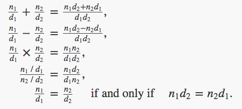

# Notes

#### Abstraction

- If after going through Chapter 1, you yearn for a more layman understanding of what abstraction is, the definitions below would help. 

- In software engineering and computer science, abstraction is a technique for arranging complexity of computer systems. It works by establishing a level of simplicity on which a person interacts with the system, suppressing the more complex details below the current level.

-  Definition from stack:  https://stackoverflow.com/questions/21220155/what-does-abstraction-mean-in-programming

    - Abstracting something means to give names to things, such that the name captures the core of what a function or a whole program does.

    - If i ask you to draw a square, you would know how to do it.

    - A square is an abstraction of "draw four equal lines perpendicular to each other conencted together at a corner".

    - Imagine, everytime i want to have you draw a square, i would have to tell you a detailed steps of drawing four equal lines ... That would be really slow and efficient.

    - Thus, the first benefit of abstraction is that it allows me to get things done way quicker. I can simply say draw a square instead of saying a long list of instructions.

    - The second is that it allows me to be more expressive. We identified special shapes and gave it unique names. We can see the world of geometry in terms of these special shapes and patterns of lines instead of just a bunch of unnamed collection of lines. Our vocabulary increases, and we can also express ourselves in terms of these shapes & patterns rather than just lines. This leads to the third benefit.

    - It allows us to compose larger abstractions from two or more abstractions. We can define a house in terms of a triangle and a square. We can define a village as multiple houses next to each other. We can define a city as multiple villages near one another.

    - Going back to programming, abstractions allow us to write programs that are shorter, easier to write and read. For programs, there is also the added benefit of modularity and reusability.

#### Part 1 Recap 

- Concentrated on processes and the role of procedures in program design

- We saw how to use primitive data (numbers) and primitive operations (arithmetic operations) 

- How to combine procedures to form compound procedures through composition, conditionals, and the use of parameters, and how to abstract procedures by using define

- Saw that a procedure can be regarded as a pattern for the local evolution of a process. Author phrases this section in a weird way that i still don't quite understand. He explored two key types of processes - namely a recursive and an iterative process (loops).

- Saw that higher-order procedures enhance the power of our language by enabling us to manipulate, and thereby to reason in terms of, general methods of computation.

- Much of the essence of programming is captured in the concepts above. 


#### What's coming in Part 2

- Programs are typically designed to model complex phenomena, and more often than not one must construct computational objects that have several parts in order to model real-world phenomena that have several aspects.

- In this part of the book, we will look at more complex data. We will combine data objects to form compound data.

- Why do we want compound data in a programming language?

    - For the same reasons we want compound procedures:

        - elevate the conceptual level at which we can design our programs

        - increase the modularity of our designs

        - enhance the expressive power of our language (equivalent to elevating the conceptual level)

- Just as the ability to define procedures enables us to deal with processes at a higher conceptual level than that of the primitive operations of the language, the ability to construct compound data objects enables us to deal with data at a higher conceptual level than that of the primitive data objects of the language

- Further elaboration will come as i better understand the materials covered in this section

## Part 2: Building Abstractions with Data

### 2.1 Introduction to Data Abstraction

-  Procedure abstraction: separate the way the procedure would be used from the details of how the procedure would be implemented in terms of more primitive procedures.

- Data abstraction: enables us to isolate how a compound data object is used from the details of how it is constructed from more primitive data objects.

- Basic idea of data abstraction:

    - Structure the programs, that use compound data objects, so that they operate on 'abstract data'.

    - Define a 'concrete' data representation independent of the programs that use the data.

    - The interface between these two parts of our system will be a set of procedures, called *selectors* and *constructors*, that implement the abstract data in terms of concrete representation.

    - To illustrate this technique, we will consider how to design a set of procedures for manipulating rational numbers.

#### 2.1.1 Example: Arithmetic Operations for Rational Numbers

- Lets say we want to do arithmetic with rational numbers

    - we want to ble able to add, subtract, multiply and divde rational numbers and test whether two rational numbers are equal.

- Using a useful abstraction technique known as *wishful thinking*

- We start by asumming that we already have a way of:

    - constructing a rational number from a numerator and a denominator.

    - extracting (selecting) its numerator and denominator.

- And that the constructors and selectors are available as procedures:

```clojure
# Constructor

(make-rat <n> <d>) returns the rational number who numerator is the integer <n> and whose denominator is the integer <d>

# Selectors

(numer <x>) returns the numerator of the rational number x

(denom <x>) returns the denominator of the rational number x
```

- Once we have the constructors and selectors for rational numbers, we can express its mathematical rules as procedures.

<p text-align="center">
    
</p>

```clojure
(define (add-rat x y)
  (make-rat (+ (* (numer x) (denom y))
               (* (numer y) (denom x)))
            (* (denom x) (denom y))))

(define (sub-rat x y)
  (make-rat (- (* (numer x) (denom y))
               (* (numer y) (denom x)))
            (* (denom x) (denom y))))

(define (mul-rat x y)
  (make-rat (* (numer x) (numer y))
            (* (denom x) (denom y))))

(define (div-rat x y)
  (make-rat (* (numer x) (denom y))
            (* (denom x) (numer y))))

(define (equal-rat? x y)
  (= (* (numer x) (denom y))
     (* (numer y) (denom x))))
```

- In order to learn how to implement the concrete level of our data abstraction, we first need to know what a Pair is.

##### Pair

- Our language provides a compound structure called a pair that helps with the concrete implementation.

- A pair can be constructed with the primitive procedure ```cons```.

    - This procedure takes two arguments and returns a compound data object that contains the two arguments as parts. 
    
    - We can extract the parts of a ```pair``` using the primitive procedures car and cdr. 

```clojure
(define x (cons 1 2))

(car x)
1

(cdr x)
2
```

- A pair is a data object that can be given a name and manipulated, just like a primitive data object. 

- Moreover, cons can be used to form pairs whose elements are pairs, and so on:

```clojure
(define x (cons 1 2))
(define y (cons 3 4))
(define z (cons x y))

(car (car z))
1

(car (cdr z))
3
```

 - This ability to combine pairs means that pairs can be used as general-purpose building blocks to create all sorts of complex data structures. 
 
 - The single compound-data primitive pair, implemented by the procedures cons, car, and cdr, is the only glue we need. 
 
 - Data objects constructed from pairs are called **list-structured data**.

 ##### Representing Rational Numbers

- Represent a rational number as a pair of two integers: a numerator and denominator

```clojure
(define (make-rate n d) (cons n d))
(define (numer x) (car x))
(define (denom x) (cdr x))
 ```

 - in order to display the results of our computations, we can print rational numbers by printing the numerator, a slash and the denominator.

 - ```display``` is the Scheme primitive for printing data. The Scheme primitive newline starts a new line for printing. 
 
```clojure
(define (print-rat x)
  (newline)
  (display (numer x))
  (display "/")
  (display (denom x)))
```

 - Neither of these procedures returns a useful value, so in the uses of print-rat below, we will show only what print-rat prints, not what the interpreter prints as the value returned by print-rat.

```clojure
(define one-half (make-rat 1 2))
(print-rat one-half)
1/2

(define one-third (make-rat 1 3))
(print-rat
  (add-rat one-half one-third))
5/6

(print-rat
  (mul-rat one-half one-third))
1/6

(print-rat
  (add-rat one-third one-third))
6/9
```

#### Abstraction Barriers

- In general, the underlying idea of data abstraction is to:
    
    - identify for each type of data object a basic set of operations in terms of which all manipulations of data objects of that type will be expressed,
    
    - and then to use only those operations in manipulating the data.

- Let's visualise the structure of the rational number system below. The double horizontal lines represent **abstraction barriers** that isolate different levels of the system. At each level, the barriers separate the prgorams (above) that use the data abstractions from the programs (below) that implement the data abstractions.

----------------------------------

- Highest level of data abstraction

- Programs using rational number data and operators. 

```clojure
(add-rat one-half one-third))
```

- Procedures supplied:
```add-rat```, ```sub-rat```, ```mul-rat```, ```div-rat```  

----------------------------------
----------------------------------


- Programs implementing rational number data and operators

- Done solely in terms of the constructors and selectors ```make-rat```, ```numer``` and ```denom```

```clojure
(define one-half (make-rat 1 2))

(define (add-rat x y)
  (make-rat (+ (* (numer x) (denom y))
               (* (numer y) (denom x)))
            (* (denom x) (denom y))))
```
 
- Procedures supplied:
```make-rat```, ```numer```, ```denom```

----------------------------------
----------------------------------

- Programs implementing rational number constructors and selectors

```clojure
(define (make-rat n d) (cons n d))
(define (numer x) (car x))
(define (denom x) (cdr x))
```

- Procedures supplied:
```cons```, ```car```, ```cdr```

----------------------------------
----------------------------------

- Programs implementing pairs 

----------------------------------
